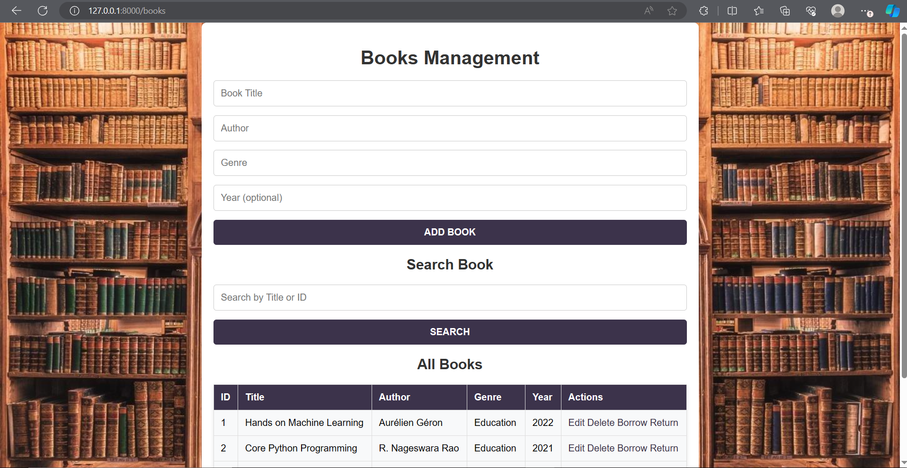
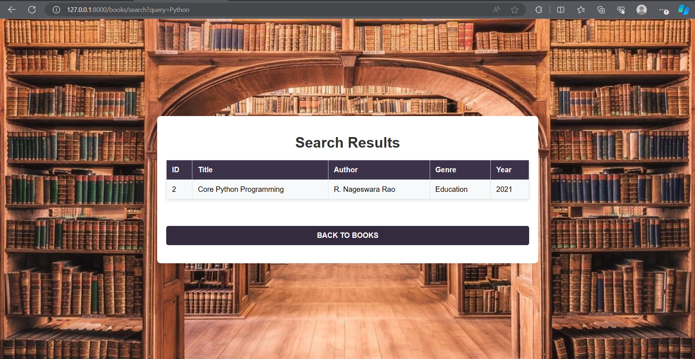
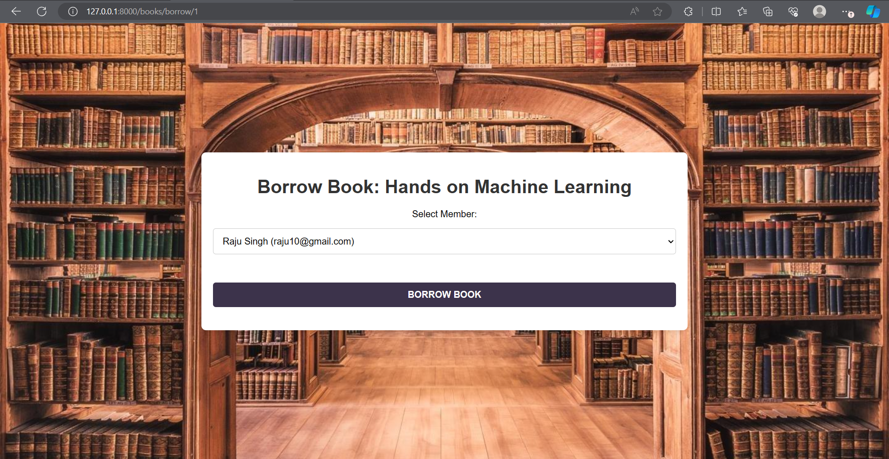
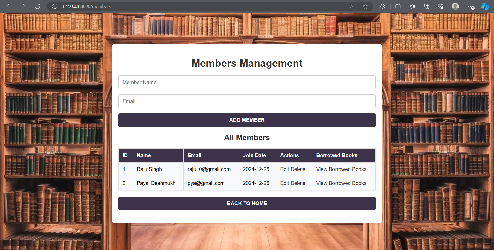

# Library Management System

This is a Library Management System built using Python and Flask. It allows users to manage books, members, and book loans. The system supports operations such as adding, updating, deleting books and members, as well as borrowing and returning books.

## Features
- **Books Management**: Add, update, delete, and search books.
- **Member Management**: Add, update, and delete library members.
- **Book Borrowing/Returning**: Borrow books for members and return them after the loan period.
- **Loan History**: Track borrowed books by each member.
- **SQLite Database**: The system uses an SQLite database to store books, members, and loan information.

## Technologies Used
- **Flask**: Web framework for building the application.
- **SQLAlchemy**: ORM for interacting with the SQLite database.
- **SQLite**: Database used to store data.

## How to Run the Project

### Prerequisites
Make sure you have Python installed on your system. You can download Python from [here](https://www.python.org/downloads/).

### Step 1: Clone the Repository
First, clone the repository to your local machine:
git clone https://github.com/Yash99-a/Library-Management-System.git

Step 2: Navigate to the Project Folder in command prompt
cd library-management-system

Step 3: Install the Required Dependencies
Create a virtual environment (optional but recommended) and install the dependencies:
python -m venv venv
source venv/bin/activate   # For macOS/Linux
venv\Scripts\activate      # For Windows

Step 4: Then install the required dependencies:
pip install -r requirements.txt

Step 5: Run the Flask Application
Run the following command to start the Flask server:
python app.py

##Images
homepage:

Books Page:

Update Book  Page:

Search Page:

Borrow Book Page:

Members:

Update Member Page:

Borrowed books list By members:

